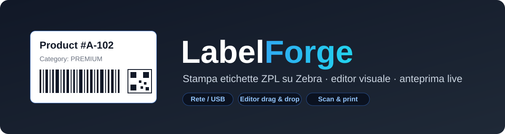
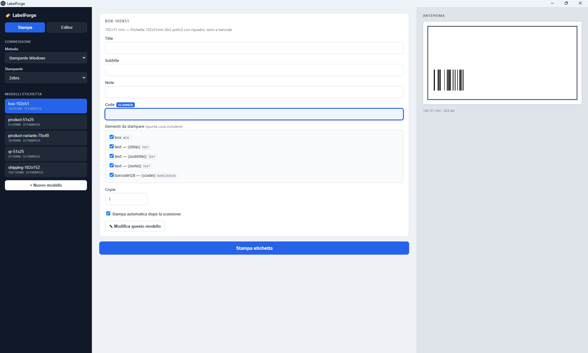

<div align="center">



### Print ZPL labels on Zebra printers — desktop app + CLI, with a visual template editor.

Design labels visually, fill fields (or scan them), and print over network or USB.

[](LICENSE)
[](#-requirements)
[](https://www.electronjs.org/)
[](https://nodejs.org)
[](https://github.com/dextsamu/labelforge/actions/workflows/build.yml)

**🇬🇧 English** · [🇮🇹 Italiano](README.it.md)

</div>

---

> **LabelForge** turns dynamic JSON templates into ZPL and sends them straight to a Zebra printer
> (tested on the **ZD410**). It works from a clean desktop UI *or* the command line, with a
> drag‑and‑drop template editor and a live preview. No paid dependencies.

<div align="center">
  
</div>

## ✨ Features

| | |
|---|---|
| 🖨️ **Multiple connections** | Network (raw port 9100), Windows printer by name (Win32 API — works with any port type, even Zebra Setup Utilities virtual ports), or USB device on Linux/Mac. |
| 🌐 **Multi-language output** | Prints **ZPL** (tested) and, experimentally, **TSPL / EPL / CPCL / EZPL**. Same editor and preview; only the generated commands differ. |
| 🧩 **Dynamic templates** | JSON templates with text, barcodes (Code128, Code39, Code93, EAN‑13), QR code, DataMatrix, lines and boxes. Sizes in mm; 203/300 dpi. |
| 🎨 **Visual editor** | Live preview with **real Code128 & QR** rendering; select, drag, resize and snap elements to a grid. No JSON editing required. |
| ⌨️ **Smart fields** | `{{field}}` inputs as text, dropdowns, or per‑option quantity lists (one label per unit). |
| ⚡ **Scan & print** | Auto‑print after a barcode scan (the scanner acts as a keyboard) — ideal for batches. |
| 📄 **CSV batch print** | Import a CSV and print one label per row (columns map to `{{fields}}`). |
| 🔁 **Share templates** | Export/import templates as `.json`; test the printer connection before printing. |
| 🕘 **History & shortcuts** | Reprint from print history, template search, dark/light theme, editor undo/redo and keyboard shortcuts (Ctrl+P/S/F/Z/Y). |
| 💾 **Remembers everything** | Printer, last template, theme and preferences saved between sessions. |
| 📦 **Ship as an app** | Package to a Windows `.exe`; a desktop shortcut is created automatically on first run. |

## 📋 Requirements

- [Node.js](https://nodejs.org) 18+ (20+ recommended)
- Windows for USB printing by printer name — network (IP) works everywhere

## 🚀 Quick start (GUI)

```bash
npm install
npm start
```

## 🖥️ Command line (CLI)

```bash
node cli.js list-templates                 # list templates
node cli.js list-printers                  # list Windows printers
# print over network
node cli.js print --template product-51x25 --ip 192.168.1.50 --set title="Item" --set code=12345
# print by Windows printer name (recommended)
node cli.js print --template product-51x25 --printer "Zebra" --set title="Item" --set code=12345
node cli.js test --printer "Zebra"         # quick test label
node cli.js calibrate --printer "Zebra"    # auto‑calibrate sensors
```

## 📦 Build the Windows EXE

Recommended (no code‑signing issues):

```bash
npm install
npm run pack:exe
```

Output in `dist-app/LabelForge-win32-x64/` — a double‑clickable executable.
Alternatively an installer via `npm run dist` (electron‑builder; on Windows may require Developer Mode).

### 🤖 Automatic build on GitHub

The [`build.yml`](.github/workflows/build.yml) workflow builds apps for **Windows, Linux and macOS**.
Push a `vX.Y.Z` tag to produce a **Release** with the three zips attached, or run it manually from the
**Actions** tab:

```bash
git tag v1.0.0
git push origin v1.0.0
```

## 🤝 Contributing

Contributions welcome — see [CONTRIBUTING.md](CONTRIBUTING.md). Open an issue (templates provided)
before large changes. The packaged app is not code‑signed, so Windows SmartScreen may warn on first
run; signing and auto‑update are optional.

## 🖨️ Printer languages & compatibility

LabelForge generates the printer command language from the same visual template. The language is set
per template (editor → *Printer language*).

| Language | Status | Typical printers |
|---|---|---|
| **ZPL** | ✅ Tested (ZD410) | Zebra ZPL family: ZD410/ZD420/ZD620, GK420/GX420, ZT230/ZT411, ZQ mobile — 203/300/600 dpi |
| **TSPL** | 🧪 Experimental, untested | TSC (TE200, TDP‑244, TTP‑244), some Godex (EZPL is similar) |
| **EPL** | 🧪 Experimental, untested | Older Zebra/Eltron (LP2824, TLP2844, some GK in EPL mode) |
| **CPCL** | 🧪 Experimental, untested | Zebra mobile (QLn, ZQ511/ZQ521, iMZ) |
| **EZPL** | 🧪 Experimental, untested | Godex (G500, RT200, DT2x) |

> ⚠️ **Only ZPL is tested on real hardware.** TSPL, EPL, CPCL and EZPL are provided as a starting point
> and have **not** been verified on physical printers — command syntax and especially text sizing may
> need adjustment. Contributions and test reports for these languages are very welcome (open an issue).

## 🧩 Templates

Templates live in `templates/*.json`. Minimal example:

```json
{
  "name": "product-51x25",
  "dpi": 203,
  "width_mm": 51,
  "height_mm": 25,
  "tear_off": 30,
  "field_meta": {
    "category": { "type": "select", "label": "Category", "options": ["A", "B", "C"] }
  },
  "elements": [
    { "type": "text", "x_mm": 3, "y_mm": 2, "height_mm": 3, "width_mm": 3, "text": "{{title}}" },
    { "type": "barcode128", "x_mm": 3, "y_mm": 11, "bar_height_mm": 8, "text": "{{code}}" }
  ]
}
```

**Element types:** `text`, `barcode128`, `code39`, `code93`, `ean13`, `datamatrix`, `qrcode`, `box`, `line`.
**Field types** (`field_meta`): `select` → dropdown, `multi-qty` → per‑option quantity list (one
label per unit). Included samples: product, shipping, QR, and `product-variants` (dropdown + qty list).

## 🗂️ Project structure

```
cli.js                        command line
gui/                          Electron app (main, preload, index.html, renderer, preview)
lib/zpl.js                    ZPL generator
lib/print.js                  network / Windows printer / USB sending
scripts/send-raw-printer.ps1  RAW send to a Windows printer by name
templates/                    example templates (editable)
.github/workflows/build.yml   automatic exe build
```

## 🔧 Technical notes

ZPL is sent **raw**: on Windows via `OpenPrinter`/`WritePrinter` (any port type, including virtual
ports); over the network on port 9100; on Linux/Mac by writing to the device (e.g. `/dev/usb/lp0`).
If labels don't stop at the tear bar, run `calibrate` and tune `tear_off` in the template.

> `npm audit` may report warnings from the dev tools (Electron/builder). They don't ship in the app
> and can be ignored — **do not** run `npm audit fix --force` (it breaks the build).

## 📄 License

Released under the [MIT License](LICENSE).
